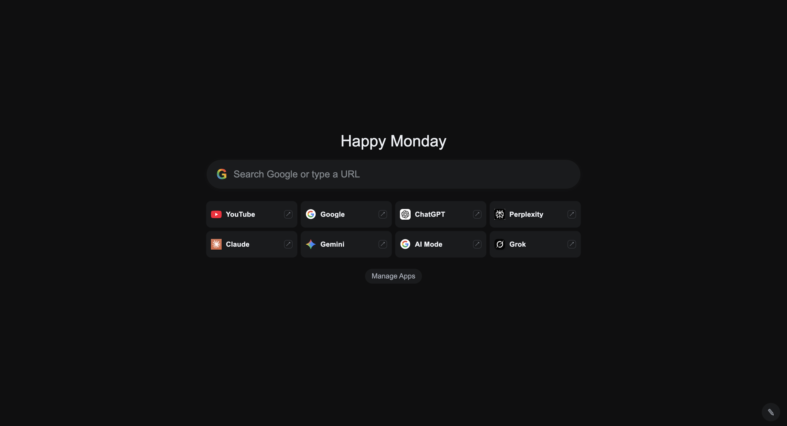

# Personal AI Quick Search New Tab

A Chrome New Tab extension for fast searching across your favorite engines and AI apps from one page.

<p align="center">
  
</p>

## Preview



## Quick Install

### Option 1: Clone repo

```bash
git clone <your-repo-url>
cd "Chrome tab extension"
```

### Option 2: Download ZIP

1. Download the project ZIP from GitHub
2. Extract it
3. Open the extracted folder (`Chrome tab extension`)

### Load in Chrome

1. Open `chrome://extensions`
2. Turn on **Developer mode**
3. Click **Load unpacked**
4. Select the project folder
5. Open a new tab

## What this extension is

This extension replaces the default Chrome New Tab with a personal quick-launch search dashboard.

You can:
- type once and search quickly
- open your preferred AI/search app directly
- customize theme and wallpaper
- manage app tiles (add, remove, reorder)

## Why this extension was made

When using multiple tools like Google, ChatGPT, Perplexity, Claude, Gemini, and YouTube, switching between sites repeatedly is slow.

This extension keeps everything in one place so search is faster and cleaner.

## How it helps

- Faster workflow for daily browsing and research
- Less tab switching
- One consistent place for all favorite engines
- Personalizable New Tab experience

## Main features

1. Search behavior
- Press `Enter` in the search bar: opens Google search
- Click an app tile: opens that app with your query

2. Default app tiles
- Google
- ChatGPT
- Perplexity
- Claude
- Gemini
- YouTube
- AI Mode
- Grok

3. Manage Apps
- Add custom apps
- Remove unwanted apps (with confirmation)
- Drag app tiles to reorder (Manage mode)

4. Customize panel (pencil icon at bottom-right)
- Color themes (10 preset colors)
- Change wallpaper
- Remove wallpaper

## Install in Chrome (Developer Mode)

1. Open Chrome and go to `chrome://extensions`
2. Turn on **Developer mode** (top-right)
3. Click **Load unpacked**
4. Select this project folder:
`/Users/srivatsavkaramala/Chrome tab extension`
5. Open a new tab

## How to use

1. Type a query in the search bar
2. Choose one of the following:
- Press `Enter` for Google
- Click an app tile to search in that app
3. Click **Manage Apps** to add/remove/reorder apps
4. Click the **pencil icon** to change theme or wallpaper

## Adding custom apps

To add a custom app tile, paste only the app URL.

Example:
`https://grok.com`

You do not need to add `{query}` manually in the Manage Apps form.

## Files in this project

- `manifest.json` - Chrome extension config
- `newtab.html` - page structure
- `newtab.css` - styling
- `newtab.js` - behavior and logic
- `assets/default-wallpaper.png` - default background preview image

## Updating after code changes

1. Open `chrome://extensions`
2. Click **Reload** on this extension
3. Open a new tab to verify updates

## Troubleshooting

- UI not updating:
Reload extension from `chrome://extensions`

- Tiles missing:
Open Manage Apps and restore/add apps (or reload)

- Wallpaper not changing:
Try upload again and reload extension

## License

This project is licensed under the MIT License. See [LICENSE](LICENSE).
